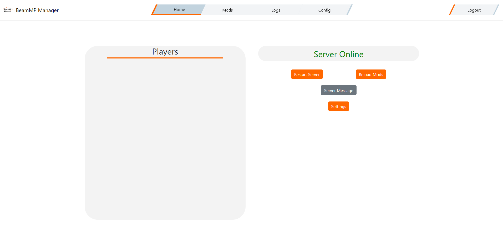
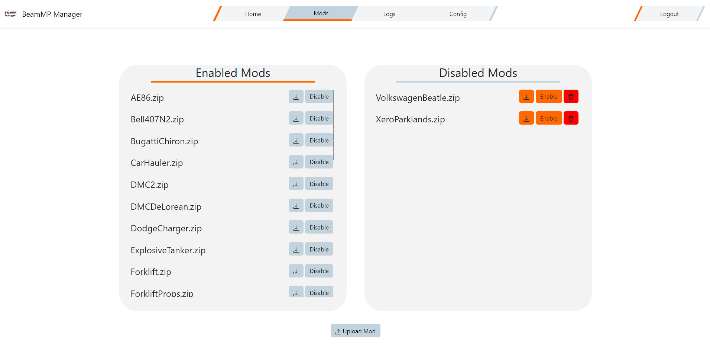

# BeamMP Manager

A configurable web-based manager for your BeamMP server using Discord as authentication.

> [!IMPORTANT]
> This script is intended for managing a BeamMP server on a remote server. It is recommended to configure this behind a reverse proxy such as [Nginx](https://nginx.org/), unless you are not exposing the manager to the public internet.

### **Prerequisites**

* Be able to run a standalone [BeamMP Server](https://github.com/BeamMP/BeamMP-Server)
* Have the client ID and client secret of your [Discord App/Bot](https://discord.com/developers/applications)*. You can skip this prerequisite if you don't plan to expose the manager to the public internet.
* [Optional] Have a [VirusTotal](https://www.virustotal.com) API key

### **Installation Option 1 (Windows and Ubuntu)**

* Download and unzip the [latest release](https://github.com/peterservices/BeamMP-Manager/releases/latest) (recommended) or [development build](https://github.com/peterservices/BeamMP-Manager/actions/workflows/build.yml) that matches your OS version and architecture
* Download or compile a [BeamMP Server](https://github.com/BeamMP/BeamMP-Server) executable, and put it in the same directory as BeamMP-Manager
* Copy the contents of `.env.example` and create a file named `.env`
  * Add your Discord App's client ID and client secret*, as well as your VirusTotal API key if you have one (SECRET_KEY will be auto-filled, or you can generate your own)
  * Change MANAGER_PORT to the port you want the web server to be served on (80 by default)
* Run the web server in the terminal with `./beammp_server.exe` or `./beammp_server` (You can also run it like a normal executable via a file manager)
  * Edit the `config.json` (See [configuring](#configuring))

### **Installation Option 2 (Every OS)**

* Install [uv](https://docs.astral.sh/uv/getting-started/installation/#__tabbed_1_2) OR a standalone compatible Python version
  * [uv] Install a compatible version of Python using the terminal (ex: `uv python install 3.13`)
* Clone or download and unzip [the source](https://github.com/peterservices/BeamMP-Manager/archive/refs/heads/main.zip)
  * Install dependencies (With uv: Use uv in the terminal. ex: `uv sync`)
* Download or compile a [BeamMP Server](https://github.com/BeamMP/BeamMP-Server) executable, and put it in the same directory as BeamMP-Manager
* Copy the contents of `.env.example` and create a file named `.env`
  * Add your Discord App's client ID and client secret*, as well as your VirusTotal API key if you have one (SECRET_KEY will be auto-filled, or you can generate your own)
  * Change MANAGER_PORT to the port you want the web server to be served on (80 by default)
* Run the web server in the terminal with `.venv/bin/python src/main.py`
  * Edit the `config.json` (See [configuring](#configuring))

\* = Not required if only exposing locally with `require_login` config variable set to `false`

### **Features**

* Public Dashboard (No login necessary)
  * View and download mods
  * Can be turned off if desired
* Mod Management
  * View and download mods
  * Upload mods
  * Disable mods
  * Delete mods
* Player Management
  * View online players
  * Kick players
* Manage Server Settings
  * View and change server settings
  * Automatically detect maps in mods you upload
  * Autofilled options to change the map setting to
* Logging
  * Log player joins and leaves
  * Log when players finish downloading mods from the server
  * Log chat messages
  * Logs save across server restarts
* Server Management
  * Update server binary
  * Install/uninstall server-side mods such as BeamPaint
* And More
  * Restart server
  * Manually reload mods
  * Send chat messages as the server
  * User permission levels to manage dashboard access

### **Planned Features**

* Uploading mods from the BeamNG repo
* Enhanced event logging (Server start/stop, dashboard logins, etc.)
* More methods of authentication (Google)
* Option to not automatically start the server (Maybe a process-detached read-only mode?)

### **Screenshots**



 
### **Configuring**

`config.json` looks like this by default:
```
{
    "authorized_discord_users": {
        "-1": {
            "permissions": [
                "modify_settings",
                "modify_mods",
                "manage_server"
            ]
        }
    },
    "beammp_executable_path": "",
    "detect_mod_maps": true,
    "discord_oauth2_redirect_url": "",
    "maximum_log_entries": 500,
    "persist_data": true,
    "preserve_setting_changes": true,
    "public_dashboard": true,
    "require_login": true,
    "restart_on_error": true,
    "url_base_path": "/beammp",
    "virustotal_scanning": true
}
```
**authorized_discord_users** - An array of Discord user IDs who will be able to login to the web manager. Each Discord user ID has an array that has a `permissions` list. The possible permissions a user can have are `modify_settings`, `modify_mods`, `manage_server`, `clear_logs`, and `configure`.

**beammp_executable_path** - The path to your BeamMP Server executable. This should be located within the base directory of the manager.

**detect_mod_maps** - Whether uploaded mods are scanned for modded levels. If found, the level filepath will automatically be saved (if persist_data is enabled) and available in the settings dropdown.

**discord_oauth2_redirect_url** - The public URL to the web manager's `/login/oauth2` page. This URL must be added on the Discord Developer Portal under OAuth2.

**maximum_log_entries** - The maximum number of total log entries that will be stored. This is useful to limit the file size of the persistent data file.

**persist_data** - Whether data such as logs and detected level filepaths should persist across manager restarts.

**preserve_setting_changes** - Whether setting changes should be saved to the ServerConfig.toml file. If not, setting changes will be cleared after a BeamMP server restart.

**public_dashboard** - Whether the public mod dashboard is enabled. If disabled, the guest login button and associated pages will be disabled.

> [!CAUTION]
>  You should never disable **require_login** unless the server is not exposed to the public internet and you trust everyone on your network.

**require_login** - Whether users must login to access the dashboard. When disabled, anyone with network access will have full permissions.

**restart_on_error** - Whether the manager will attempt to restart the BeamMP Server executable if it crashes. To prevent restart loops, the manager will only attempt to restart it once.

**url_base_path** - The base URL path to use for accessing the web manager. This is useful if you run multiple web services on the same URL, otherwise you can just leave this empty.

**virustotal_scanning** - Whether mod uploads should be scanned by VirusTotal before they are added to the server. Set to `false` if you do not have a VirusTotal API key.

> [!IMPORTANT]
> BeamMP-Manager is not affiliated or endorsed in any way by BeamPaint, BeamMP, or BeamNG Gmbh.
